# Personal Paper Daily Architecture

## Scope and principles

This document defines the intended module boundaries for Stages 1–9. Stage 0 implements none of these modules. The design extends the current `zotero_arxiv_daily` package without silently replacing existing core interfaces.

Principles:

- Rank before downloading full PDFs or calling an analysis LLM.
- Pass validated, versioned schemas across module boundaries.
- Preserve provenance from Zotero/arXiv/PDF block through final Chinese claim.
- Isolate failure per paper and per delivery target.
- Keep private inputs and local feedback outside Git.
- Cache deterministic expensive work by content and implementation version.
- Make renderers pure; keep authenticated network clients behind interfaces.
- Prefer narrow adapters around upstream and licensed Hermes code.

## Proposed package layout

```text
src/zotero_arxiv_daily/
├── interest/
│   ├── base.py
│   └── zotero.py
├── retriever/                 # existing registry retained
├── reranker/                  # existing registry retained
├── candidates/
│   └── store.py
├── documents/
│   ├── downloader.py
│   ├── parser.py
│   ├── sections.py
│   ├── captions.py
│   ├── mapper.py
│   └── evidence.py
├── analysis/
│   ├── schemas.py
│   ├── analyzer.py
│   └── validator.py
├── delivery/
│   └── feishu.py
├── viewer/
│   ├── builder.py
│   └── feedback.py
└── pipeline/
    └── daily.py
```

Paths are planned, not created in Stage 0. Existing `executor.py`, `protocol.py`, `construct_email.py`, and `utils.py` remain intact until their owning stage has tests and explicit approval.

## Data flow

```mermaid
flowchart LR
    Z["Zotero interest provider"] --> IC["Versioned interest corpus"]
    A["arXiv retriever"] --> CP["Candidate pool ≤ 30"]
    IC --> ER["Embedding reranker"]
    CP --> ER
    ER --> CS["Candidate store"]
    CS --> LR["Optional LLM rerank ≤ 15"]
    LR --> TOP["Full-analysis selection ≤ 5"]
    CS --> WEB["Static viewer candidate summaries"]
    TOP --> PD["PDF downloader"]
    PD --> PP["PDF parser"]
    PP --> SP["Section parser"]
    PP --> CD["Caption detector"]
    SP --> DM["Document mapper"]
    CD --> DM
    DM --> EE["Evidence extractor"]
    EE --> LA["LLM analyzer"]
    LA --> EV["Evidence validator"]
    EE --> EV
    EV --> FA["Validated paper analysis"]
    FA --> FR["Feishu renderer"]
    FR --> FC["Feishu client"]
    FA --> WEB
    BL["Browser localStorage (local only)"] -. explicit export/import .-> FB["Ignored private feedback store"]
    FB --> IC
```



The candidate store is the cost boundary: retrieval and embedding ranking occur before selected papers may cross into PDF download and full analysis.

## Structured data contracts

All persisted/inter-module records use strict Pydantic models or an equivalent validator. Each persisted envelope contains `schema_version`, `created_at`, and the relevant implementation/model versions.

### Core records

| Record | Essential fields | Purpose |
|---|---|---|
| `InterestPaper` | `paper_id`, `title`, `abstract`, `collection_paths`, `added_at`, `feedback_weight` | Privacy-minimized Zotero-derived ranking input. |
| `CandidatePaper` | `paper_id`, `arxiv_id`, `version`, `title`, `authors`, `abstract`, `categories`, `published_at`, `arxiv_url`, `pdf_url`, `code_url` | Normalized daily candidate without full-text content. |
| `RankingRecord` | `paper_id`, `embedding_score`, `llm_score`, `final_score`, `rank`, `reason`, `model_versions` | Auditable selection decision. |
| `CandidateBatch` | `run_id`, `retrieved_at`, `categories`, `candidates`, `selected_for_llm`, `selected_for_full_analysis` | Versioned daily ranking snapshot. |
| `PdfArtifact` | `paper_id`, `source_url`, `sha256`, `media_type`, `byte_size`, `local_path`, `downloaded_at` | Validated cached PDF reference. |
| `DocumentPage` | `page_index`, `pdf_page`, `display_label`, `width`, `height`, `blocks` | Original-page coordinate anchor. |
| `SectionNode` | `section_id`, `title`, `normalized_kind`, `level`, `page_start`, `page_end`, `block_ids` | Logical document hierarchy. |
| `VisualArtifact` | `visual_id`, `kind`, `label`, `caption`, `pdf_page`, `section_id`, `bbox`, `image_path` | Figure/Table identity and image binding. |
| `EvidenceRecord` | `evidence_id`, `paper_id`, `pdf_page`, `parser_page_index`, `section_id`, `visual_id`, `label`, `caption`, `evidence_text`, `image_path`, `confidence`, `source_type`, `inferred`, `support_explanation` | Traceable evidence for claims and ablations. |
| `ClaimRecord` | `claim_id`, `kind`, `text_zh`, `source_type`, `inferred`, `evidence_ids` | Insight, method, result, or limitation claim. |
| `ParameterRecord` | `name`, `symbol`, `role`, `final_value`, `selection_method`, `per_model_tuning`, `evidence_ids`, `ablation_claim_ids` | Parameter and ablation linkage. |
| `PaperAnalysis` | titles, recommendation, problem, Insights, Method modules, differences, parameters, results, limitations, links, validation status | Complete Chinese reading contract. |
| `FeedbackRecord` | `paper_id`, `read`, `favorite`, `irrelevant`, `updated_at`, `source` | Private, idempotent feedback. |
| `DailyDigest` | `run_id`, `date`, `highlighted_paper_ids`, `web_paper_ids`, `partial_failures`, `site_url` | Shared Feishu/site publication input. |

`source_type` is an enum: `author_statement`, `system_summary`, or `system_inference`. `system_inference` requires `inferred=true`; other values require `inferred=false`.

## Module contracts

The following ownership table is normative for every numbered contract below. “Forbidden dependencies” are architectural constraints, not merely current implementation details: tests must fail if a module crosses one of these boundaries. “Source evidence” identifies the audited implementation or design basis for reuse/adaptation decisions.

| # | Module | Responsibility | Owning stage | Forbidden dependencies | Source evidence |
|---:|---|---|---|---|---|
| 1 | Zotero interest provider | Read, filter, normalize, and fingerprint private interest papers. | Stage 1 | PDF, LLM, delivery, viewer | Upstream `Executor.fetch_zotero_corpus`, `filter_corpus`, `glob_match`, and `pyzotero` usage. |
| 2 | arXiv retriever | Retrieve and normalize metadata without downloading or parsing PDFs. | Stage 1 | PDF parser, LLM, delivery | Upstream retriever registry and `arxiv_retriever.py`; eager `convert_to_paper` behavior is the adaptation boundary. |
| 3 | embedding reranker | Score candidates against the interest corpus and record ranking provenance. | Stage 1 | PDF, analysis, delivery | Upstream `BaseReranker` plus local/API reranker registry and tests. |
| 4 | candidate store | Persist versioned ranking inputs, outputs, and selection decisions. | Stage 1 | Network clients, PDF, LLM, delivery | New contract derived from the product audit trail and cost-boundary requirements. |
| 5 | PDF downloader | Download only selected PDFs into a content-addressed private cache. | Stage 2 | LLM, renderer, feedback | Upstream download helper and licensed Hermes `download_pdf` flow; both require safety adaptation. |
| 6 | PDF parser | Produce page-anchored blocks and images while preserving physical coordinates. | Stage 2 | LLM, renderer, feedback | Upstream pymupdf4llm extraction path, adapted to retain pages and geometry. |
| 7 | section parser | Map document blocks into a normalized section hierarchy. | Stage 2 | Network, LLM, renderer | New contract required because neither audited project preserves a testable section graph. |
| 8 | caption detector | Bind Figure/Table labels, captions, pages, sections, and image regions. | Stage 2 | Network, LLM, renderer | New contract required by the evidence schema; audited projects do not provide this binding. |
| 9 | evidence extractor | Create claim-ready evidence candidates without inventing missing content. | Stage 3 | Delivery, viewer, feedback | New contract derived from the required Insight/Method/parameter/ablation evidence path. |
| 10 | document mapper | Validate and expose resolvable page/block/section/visual relationships. | Stage 2 | Network, LLM, renderer | New contract joining the new page, section, caption, and visual records. |
| 11 | LLM analyzer | Generate schema-bound Chinese draft analysis from mapped evidence. | Stage 3 | Direct filesystem, delivery, viewer, feedback | Upstream OpenAI-compatible configuration/client concept and `Paper` analysis methods, adapted away from free-form mutation. |
| 12 | evidence validator | Reject or quarantine claims, parameters, and ablations lacking valid bindings. | Stage 4 | Network, LLM, delivery | New contract implementing the product's non-fabrication and inference-label rules. |
| 13 | structured schemas | Define versioned records and cross-record invariants shared by all stages. | Stage 1, evolved only with owning-stage migrations | Service clients, orchestration, rendering frameworks | New Pydantic-or-equivalent contracts; upstream dataclasses require compatibility adapters. |
| 14 | Feishu renderer | Convert a validated digest into a deterministic, concise Feishu payload. | Stage 6 | Credentials, network, unvalidated drafts | Licensed Hermes Chinese digest ordering and cron-output presentation, adapted to structured evidence. |
| 15 | Feishu client | Authenticate and deliver idempotent payloads with bounded retry. | Stage 6 | Analyzer, document parser, viewer, template mutation | New client boundary; audited Hermes source has no standalone Feishu API client. |
| 16 | static viewer builder | Produce responsive static assets and schema-versioned public site data. | Stage 5 | Credentials, LLM, Zotero, Feishu client | Licensed Hermes viewer HTML/CSS/JS, data builder, and Pages workflow, adapted from Excel-coupled data. |
| 17 | feedback store | Persist private read/favorite/irrelevant state and expose explicit exports. | Stage 8 | Public artifact writes, Zotero mutation, LLM | Licensed Hermes browser-local favorite state is reusable as a starting point; read/irrelevant state is new. |
| 18 | GitHub Actions pipeline | Orchestrate scheduled/manual stages, caches, reports, and static deployment safely. | Stage 7 | Domain logic, secret printing, upstream writes | Upstream `ci.yml`/`main.yml` and licensed Hermes `pages.yml`, all adapted to least privilege and staged execution. |

### 1. Zotero interest provider

- **Input:** environment-provided `ZOTERO_ID`/`ZOTERO_KEY`, include/exclude glob lists, optional prior `FeedbackRecord` values.
- **Output:** validated `list[InterestPaper]` and a privacy-safe corpus fingerprint.
- **Dependencies:** a narrow Zotero gateway around `pyzotero`; path matching may directly reuse `glob_match` and adapt `Executor.fetch_zotero_corpus`/`filter_corpus`.
- **Cache:** encrypted/private local metadata cache keyed by Zotero library version plus include/exclude configuration hash; never tracked.
- **Errors:** authentication stops the provider; malformed items are quarantined; missing collections are warnings; exclusion always wins.
- **Test seam:** fake Zotero gateway returning nested collections, zero-collection items, malformed parent links, and pagination.
- **Decision:** **Adapt** upstream `Executor` logic into a provider interface; retain current methods until compatibility tests exist.

### 2. arXiv retriever

- **Input:** categories, date window, cross-list policy, result limit.
- **Output:** metadata-only `list[CandidatePaper]`.
- **Dependencies:** existing retriever registry, `arxiv`/RSS clients.
- **Cache:** raw metadata response keyed by query/date/source version with a short TTL.
- **Errors:** bounded 429 retry with backoff; malformed entries skipped per paper; retrieval failure does not invoke PDF fallback.
- **Test seam:** canned RSS/API results and injected clock/client.
- **Decision:** **Adapt** `retriever/base.py` and `arxiv_retriever.py`. The current `convert_to_paper` eagerly extracts full text, so metadata retrieval must be separated before reuse.

### 3. embedding reranker

- **Input:** `list[CandidatePaper]`, `list[InterestPaper]`, ranking configuration.
- **Output:** candidates plus `RankingRecord` values.
- **Dependencies:** existing reranker registry and `BaseReranker`; local and API encoders remain selectable.
- **Cache:** embedding vectors keyed by normalized text hash, model, task/prompt settings, and library version.
- **Errors:** empty corpora stop ranking with a clear diagnostic; a failed API batch is retried or isolated; invalid vector shapes fail validation.
- **Test seam:** deterministic fake embeddings and exact score/order assertions.
- **Decision:** **Direct reuse of the scoring core**, with an adapter for structured records, limits, caching, and audit fields.

### 4. candidate store

- **Input:** retrieved candidates and `RankingRecord` values.
- **Output:** versioned `CandidateBatch`; selectors for top 30, top 15, and top 5.
- **Dependencies:** filesystem/JSON storage abstraction only.
- **Cache:** the store is the durable cache for daily ranking results, keyed by run ID and configuration hash.
- **Errors:** atomic write and validation; a corrupt batch is quarantined, never partially loaded.
- **Test seam:** in-memory store plus atomic-write failure injection.
- **Decision:** **New**; Hermes JSON shapes inform human-readable export but do not meet ranking/evidence requirements.

### 5. PDF downloader

- **Input:** selected `CandidatePaper`.
- **Output:** `PdfArtifact`.
- **Dependencies:** injected HTTP client and filesystem cache.
- **Cache:** SHA-256/content-addressed PDF cache; validated metadata sidecar.
- **Errors:** explicit connect/read timeout, bounded retry, maximum size, media-type and PDF signature validation, partial-file cleanup.
- **Test seam:** fake streaming responses for success, timeout, truncation, wrong content, and retry.
- **Decision:** **Adapt** upstream `_download_file` and licensed Hermes `download_pdf`; neither currently supplies the complete validation/cache contract.

### 6. PDF parser

- **Input:** `PdfArtifact`.
- **Output:** ordered `DocumentPage` records with blocks and original coordinates.
- **Dependencies:** a parser adapter, initially evaluating PyMuPDF/pymupdf4llm already present upstream.
- **Cache:** parser output keyed by PDF SHA-256 plus parser/version/options.
- **Errors:** parser crash/time limit is isolated per paper; partial output is marked incomplete and cannot silently pass evidence validation.
- **Test seam:** fixture PDFs covering text, multi-column layout, rotated pages, malformed pages, and scanned pages.
- **Decision:** **Adapt** upstream `extract_markdown_from_pdf`; the current plain Markdown string is insufficient for pages and evidence.

### 7. section parser

- **Input:** ordered document blocks.
- **Output:** section tree of `SectionNode` records and block-to-section mapping.
- **Dependencies:** deterministic heading rules plus optional parser metadata; no LLM required for the base path.
- **Cache:** part of mapped-document cache.
- **Errors:** uncertain headings map to `unknown` without inventing a section; hierarchy cycles fail validation.
- **Test seam:** synthetic block sequences and real-paper fixtures for Introduction/Method/Experiments/Ablation/Appendix.
- **Decision:** **New**.

### 8. caption detector

- **Input:** page blocks, layout coordinates, embedded image/table candidates.
- **Output:** `VisualArtifact` records.
- **Dependencies:** parser layout metadata and deterministic Figure/Table label patterns.
- **Cache:** part of mapped-document cache; images keyed by PDF hash/page/bbox.
- **Errors:** unresolved label/caption remains `null`; duplicate labels are disambiguated and flagged.
- **Test seam:** caption fixtures spanning pages, subfigures, tables, appendix labels, and missing captions.
- **Decision:** **New**.

### 9. evidence extractor

- **Input:** mapped document plus candidate claim/parameter queries.
- **Output:** candidate `EvidenceRecord` values with exact text/page/visual references.
- **Dependencies:** deterministic retrieval/index over sections and visuals; optional cached LLM extraction only after deterministic narrowing.
- **Cache:** keyed by document hash, query hash, extractor/prompt/model/schema versions.
- **Errors:** missing/ambiguous evidence returns no record; it never creates a synthetic label or value.
- **Test seam:** known-paper fixtures with exact expected page/section/label/caption and negative cases.
- **Decision:** **New**.

### 10. document mapper

- **Input:** pages, blocks, section tree, and visuals.
- **Output:** a validated document graph resolving block/section/visual/page IDs.
- **Dependencies:** PDF parser, section parser, caption detector.
- **Cache:** mapped-document artifact keyed by PDF and all component versions.
- **Errors:** dangling IDs, invalid page ranges, or bbox/page mismatches make the document invalid for analysis.
- **Test seam:** graph invariant/property tests and corrupt-reference fixtures.
- **Decision:** **New**.

### 11. LLM analyzer

- **Input:** candidate paper metadata, mapped sections, extracted evidence candidates, Chinese analysis policy.
- **Output:** draft `PaperAnalysis` containing claims and evidence IDs, never unbound evidence text.
- **Dependencies:** injected OpenAI-compatible client and prompt templates; no direct filesystem or Feishu access.
- **Cache:** keyed by provider base identity, model, prompt version, schema version, input evidence hashes, and generation settings.
- **Errors:** schema/timeout/rate-limit failures are isolated per paper; retries are bounded; partial drafts stay unpublished until validation.
- **Test seam:** fake client returns valid, malformed, hallucinated-reference, truncated, and retryable responses.
- **Decision:** **Adapt** upstream OpenAI-compatible configuration/client concept; replace `Paper` methods that directly mutate free-form TLDR fields.

### 12. evidence validator

- **Input:** draft `PaperAnalysis`, document graph, evidence registry.
- **Output:** validated analysis or structured validation errors/partial status.
- **Dependencies:** structured schemas only; no network or LLM.
- **Cache:** deterministic validation report keyed by analysis/document/schema versions.
- **Errors:** missing references, Abstract-only Insights, unresolved visuals, unsupported values, inference-flag mismatch, and unbound ablations block affected claims.
- **Test seam:** exhaustive invalid payload matrix plus valid golden examples.
- **Decision:** **New** and mandatory before any renderer.

### 13. structured schemas

- **Input:** raw dictionaries/JSON from every boundary.
- **Output:** typed records listed above with deterministic serialization.
- **Dependencies:** Pydantic as a direct dependency when Stage 1 begins, or an approved equivalent.
- **Cache:** schema version participates in every persisted cache key.
- **Errors:** validation errors identify field paths without echoing secrets/private source text.
- **Test seam:** round-trip, unknown-field, optional/null, enum, cross-record invariant, and migration tests.
- **Decision:** **New**; upstream dataclasses are adapted behind compatibility converters.

### 14. Feishu renderer

- **Input:** validated `DailyDigest` and selected `PaperAnalysis` values.
- **Output:** deterministic Feishu message/card payload with at most five detailed papers.
- **Dependencies:** no credentials or network; shared URL formatter.
- **Cache:** rendered payload keyed by digest hash and renderer version.
- **Errors:** invalid/oversized payload returns structured errors and a compact fallback; unsupported evidence is not rendered.
- **Test seam:** semantic payload assertions, size limits, mobile readability, missing-link/evidence cases.
- **Decision:** **Licensed Hermes reuse/adaptation** of concise Chinese Markdown/card composition and `feishu_output.json` fields. Hermes itself delegates delivery to cron and does not provide this standalone interface.

### 15. Feishu client

- **Input:** rendered payload, environment-resolved app/chat credentials, idempotency key.
- **Output:** send receipt with remote message ID/status.
- **Dependencies:** injected HTTP client and token provider.
- **Cache:** short-lived token cache plus sent-digest ledger; neither is tracked.
- **Errors:** explicit timeout, bounded transient retry, token refresh, idempotent duplicate handling, redacted logs.
- **Test seam:** fake token/message endpoints covering 401 refresh, 429, 5xx, timeout, duplicate, and validation errors.
- **Decision:** **New**; licensed Hermes has no direct Feishu API client.

### 16. static viewer builder

- **Input:** candidate batch, validated analyses, evidence assets, optional public-safe feedback projection.
- **Output:** static HTML/CSS/JS/assets and versioned site-data JSON.
- **Dependencies:** pure filesystem/template layer; no authenticated service.
- **Cache:** content-hashed site build; unchanged files are not rewritten.
- **Errors:** schema/reference validation precedes build; missing images render explicit placeholders; build is atomic.
- **Test seam:** JSON contract, HTML semantics/accessibility, responsive screenshots, search/filter, and safe-link tests.
- **Decision:** **Licensed Hermes reuse/adaptation** of `viewer/index.html`, `styles.css`, `app.js`, `build_data.py`, and Pages workflow. Replace Excel coupling and add full analysis, evidence, read/irrelevant states, and accessibility.

### 17. feedback store

- **Input:** stable paper ID and explicit read/favorite/irrelevant command.
- **Output:** validated `FeedbackRecord` and updated interest weighting projection.
- **Dependencies:** browser `localStorage`, explicit export/import, and a local-only
  CLI; GitHub Pages never writes to this store or auto-syncs it.
- **Cache:** the private feedback store is authoritative local state, not a generated cache.
- **Errors:** atomic updates and conflict policy; corrupt state is backed up and rejected.
- **Test seam:** in-memory store, idempotency, state conflict, migration, and concurrent-write tests.
- **Decision:** the project owner confirmed authorization to reuse/adapt Hermes
  `localStorage` favorite behavior. No license name or terms are asserted here; read/
  irrelevant semantics remain local and untracked.

### 18. GitHub Actions pipeline

- **Input:** schedule/manual trigger, repository variables, GitHub Secrets, cached artifacts.
- **Output:** run report, static site artifact/deployment, optional Feishu receipt.
- **Dependencies:** daily pipeline CLI, Actions cache/artifacts, Pages deployment actions.
- **Cache:** explicit embedding/parser/LLM caches scoped by version; never cache
  secrets, feedback state/bundles, or private raw Zotero exports in public artifacts.
- **Errors:** stage-level summaries, per-paper partial failures, concurrency control, least-privilege permissions, no secret-bearing config output.
- **Test seam:** workflow YAML validation, CLI dry-run with fakes, cache-key tests, and manual-dispatch smoke test.
- **Decision:** **Adapt** upstream `main.yml`/`ci.yml` plus licensed Hermes `pages.yml`; do not retain upstream behavior that prints generated custom configuration.

## Dependency direction

- Schemas are dependency leaves and import no service/client module.
- Interest/retriever/reranker modules depend on schemas and injected gateways only.
- Document modules depend on schemas and parser/filesystem adapters only.
- Analysis depends on schemas, mapped documents, and injected LLM clients.
- Renderers depend only on validated schemas.
- Network clients never import render templates or domain orchestration.
- `pipeline/daily.py` composes modules; domain modules never import the pipeline.

This direction prevents a renderer, feedback UI, or vendor client from bypassing evidence validation.

## Cache boundaries

| Cache | Key components | Invalidated by | Tracked? |
|---|---|---|---|
| Zotero interest metadata | library/version + include/exclude hash | library/config change | No |
| arXiv metadata | query + date + source version | TTL/query change | No |
| Embeddings | normalized text hash + model/task config | model/text/config change | No |
| Candidate batch | run ID + ranking config hash | new run/config | Private run artifact |
| PDF | source identity + content SHA-256 | content change | No |
| Parsed/mapped document | PDF hash + parser/component versions | parser/config change | No |
| Extracted evidence | document hash + query/extractor versions | evidence logic change | No |
| LLM analysis | evidence hashes + prompt/model/schema settings | any key change | No |
| Rendered outputs | validated digest hash + renderer version | digest/template change | Site output only |

Cache reads always validate schema version and content identity. A cache miss degrades to recomputation; a corrupt entry is quarantined per paper.

## Error isolation

- A Zotero provider failure prevents ranking because the interest corpus is unavailable, but it does not delete a prior valid corpus.
- A source retrieval failure is recorded per source; other sources may continue in later releases.
- A single malformed candidate, PDF, page, visual, or analysis fails only that paper.
- An evidence-validation failure removes or marks the affected claim; it cannot be hidden by renderer fallback.
- Feishu failure does not invalidate a successful static build, and static deployment failure does not resend Feishu blindly.
- Daily run status is `success`, `partial`, `empty`, or `failed`, with structured reasons.

## Security and privacy boundaries

- Environment resolution occurs at process edges; domain records never store secret values.
- Raw Zotero data, PDFs, caches, feedback, logs, and LLM responses remain under ignored private paths.
- Rendered public/static data includes only explicitly allowed paper metadata and generated analysis.
- Browser feedback is immediate `localStorage` state. Only user-initiated export and
  local CLI import reach the ignored authoritative store; Pages and scheduled Actions
  do not auto-sync private state.
- The default CLI private root is `data/private-feedback/`. The optional production
  store path is `candidate_pipeline.feedback.store_path` in `config/base.yaml`; it is
  redacted from configuration hashes. `favorite_delta` is the only feedback setting
  admitted to that hash; all other feedback fields are omitted.
- Logs include run/paper/evidence IDs and redacted error categories, not keys or unnecessary Zotero text.
- Network clients use explicit timeout and bounded retry policies.

## Existing-code disposition

### Directly reusable

- Retriever and reranker registration mechanisms.
- `BaseReranker` weighted similarity scoring core.
- `glob_match` behavior and its test coverage.
- Hydra/OmegaConf configuration composition core.
- Existing paper/email tests as regression references for preserved upstream behavior.

### Adapt without wholesale rewrite

- `Executor.fetch_zotero_corpus` and `filter_corpus` into an interest provider.
- `ArxivRetriever` into metadata-first retrieval with deferred document work.
- Local/API rerankers into cached structured ranking.
- `extract_markdown_from_pdf` behind a page-aware parser adapter.
- Product-facing `LLM_*` environment-variable mapping and the injected OpenAI-compatible client boundary.
- Existing GitHub Actions setup, with secret-safe configuration handling.

### New

- Candidate store and selection audit.
- Page/section/caption/document mapping.
- Evidence extraction and validation.
- Structured Chinese analysis schemas and analyzer.
- Direct Feishu client.
- Read/irrelevant feedback semantics.
- Cost/accounting and versioned cache infrastructure.

### Licensed Hermes reuse/adaptation

- The project owner has confirmed authorization for Hermes reuse/adaptation. The
  repository does not infer or invent a Hermes license name, terms, or license file.
- Monitor state ideas and human-readable JSON/Excel field mapping where useful.
- Chinese digest composition.
- Static viewer structure, filtering/search, favorite state, local serving, and Pages publication.
- Data build/deduplication concepts.

Sample paper JSON, generated summaries, downloaded PDFs, and local state from the archive are data fixtures for inspection only and are not copied into the product repository.
## Stage 9 local observability and benchmark boundary

Stage 9 adds no remote telemetry service. `MetricsSession` observes the six existing
daily callback boundaries with injected monotonic clock, peak-memory sampler and
token estimator interfaces. Persisted `RunMetrics` contains only versions, hashes,
fixed enums and integer aggregates. Prompt/response text is handled transiently by
the Stage 3 usage adapter and is never retained, logged or serialized.

`run-metrics.json` is atomically written beside `run-manifest.json` inside the
checked run root. It is a private run record, not a viewer member: Pages continues
to upload only `outputs/daily/viewer`, while the private Actions artifact explicitly
allowlists the manifest and metrics sidecar. A metrics failure records a fixed
manifest result without changing Stage 4 eligibility, static-site success or Feishu
status.

The offline benchmark combines an original CC0 synthetic 30/15/5 label fixture with
fake providers and the real ranker, five actual Stage 4 validations, quality
evaluation, five-paper viewer, and artifact audit. Selection expectations are read
from the fixture and compared with actual ranking output; claim, evidence and field
quality labels are derived from validation inputs and outputs. Every repetition
also executes the real daily orchestration, `MetricsSession`, atomic metrics writer,
manifest writer and sidecar-hash check. It uses no real
private library, network, paid model or send. Raw profile/run files remain ignored
under `outputs/stage9/`; only privacy-audited aggregates are tracked under
`docs/benchmarks/`.

The reproducible profile extractor rejects impossible shares and classifies
inclusive orchestration, benchmark-only, generated and artifact-audit security
frames before the 20% gate. Stage 9B may optimize only the measured
`zotero_arxiv_daily.viewer.builder:build:19` path. Frontend Design, GSAP Core and
GSAP Performance constraints were checked because this path builds the viewer; no
UI, DOM, CSS, JavaScript or animation change is authorized.
